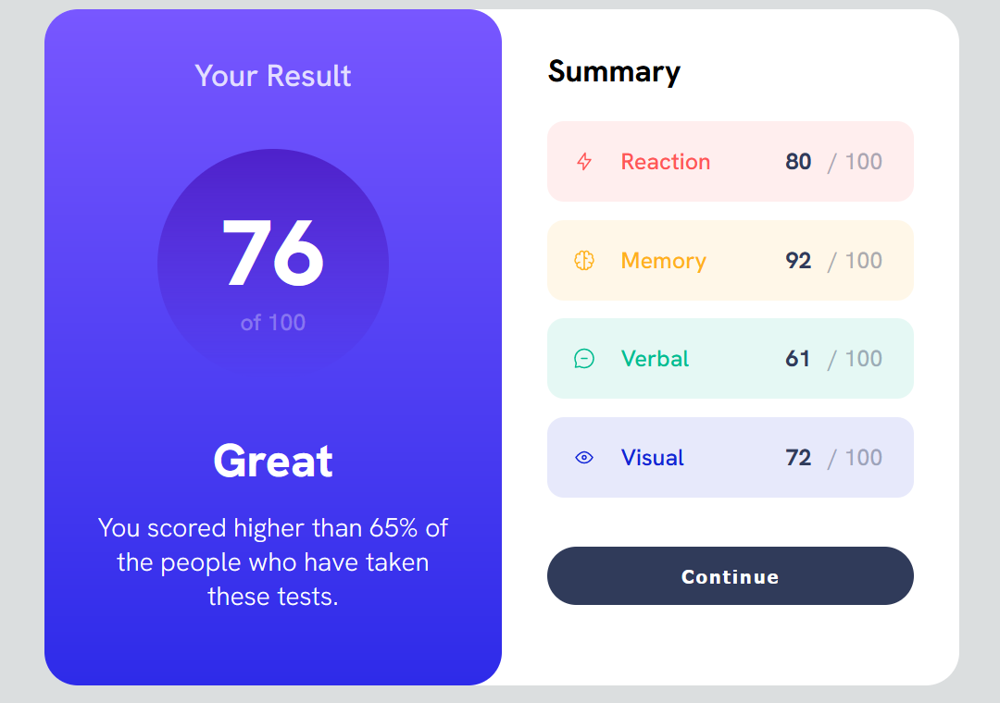

# Frontend Mentor - Results summary component solution

This is a solution to the [Results summary component challenge on Frontend Mentor](https://www.frontendmentor.io/challenges/results-summary-component-CE_K6s0maV). Frontend Mentor challenges help you improve your coding skills by building realistic projects.

## Table of contents

- [Overview](#overview)
  - [The challenge](#the-challenge)
  - [Personal challenge](#personal-challenge)
  - [Screenshot](#screenshot)
  - [Links](#links)
- [My process](#my-process)
  - [Built with](#built-with)
  - [What I learned](#what-i-learned)
  - [Continued development](#continued-development)
- [Author](#author)

## Overview

### The challenge

Users should be able to:

- View the optimal layout for the interface depending on their device's screen size
- See hover and focus states for all interactive elements on the page

### Personal challenge

- Start this challenge mobile-first, then move onto desktop
- Complete the challenge in as little time as possible

### Screenshot

### Links

- Solution URL:https://github.com/jvlazar/FrontendMentor_resultsSummaryComponent
- Live Site URL: https://jvlazar.github.io/FrontendMentor_resultsSummaryComponent/

## My process

### Built with

- Semantic HTML5 markup
- CSS custom properties
- Flexbox
- CSS Grid
- Mobile-first workflow

### What I learned

- How to use VW and VH units to scale the elements on the page in accordance to the screen size

### Continued development

- Working with VW and VH units

## Author

- Website - https://jvlazar.github.io/
- Frontend Mentor - https://www.frontendmentor.io/profile/jvlazar
